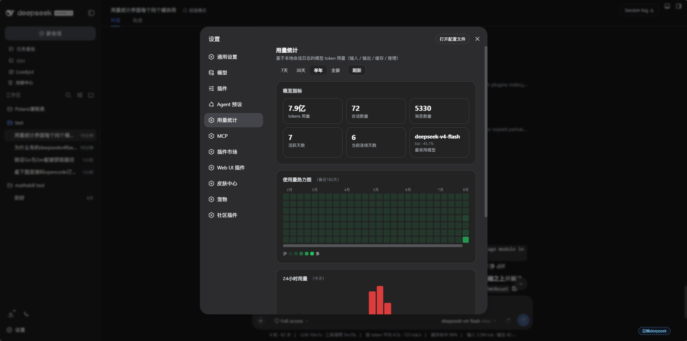
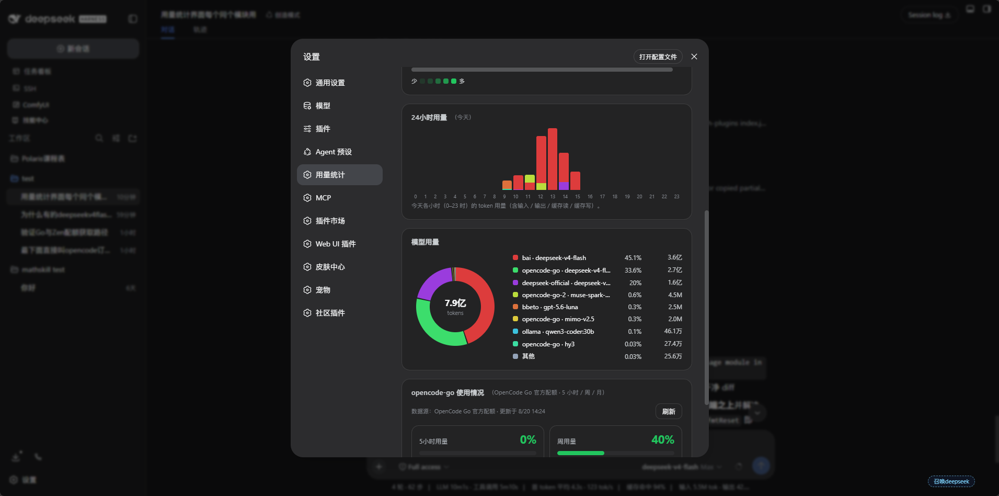
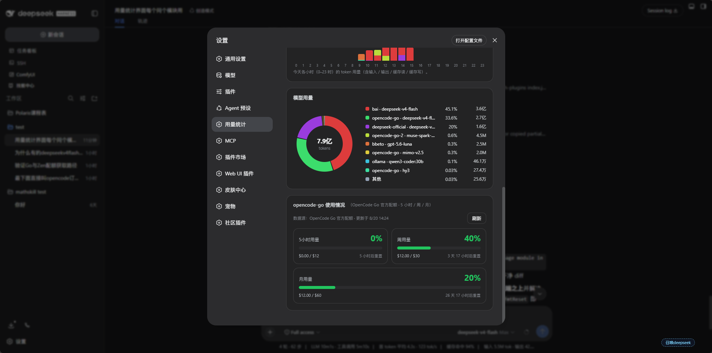

# dsh-usage-stats

[English](README.md) | [中文](README.zh-CN.md)

[DSH Web GUI](https://github.com/deepseek-ai/dsh) 的 Token 用量统计插件：设置页 **用量统计** 以 GitHub 风格热力图展示模型 Token 消耗，并附带当日 24 小时 Token 柱状图、按模型拆分统计与全历史汇总；页面最下方还提供 **opencode-go 使用情况** 面板，展示本机 opencode（Go CLI / 桌面端）订阅用量——登录为 Go 订阅时显示官方配额，否则使用本地数据库。

以外部 bundle 补丁方式工作，无需改动 DSH 源码。

## 功能特性

- **用量热力图** — GitHub 贡献风格日历；每格代表一天，颜色深浅 = 计费 Token 数。以单行换行布局覆盖最近六个月，适配设置面板宽度，无需横向滚动。
- **24 小时 Token 图** — 当前本地日按小时统计用量（每小时一根柱）。
- **按模型拆分** — 按 provider/model 堆叠柱状图与合计，并支持筛选视图。
- **时间范围筛选** — 7 / 30 / 90 / 365 天 / 全部。
- **模型筛选** — 将全部图表与合计限定到某个 provider/model。
- **opencode-go 使用情况面板** — 页面最下方的独立面板：自动识别本机 opencode 登录对应的订阅类型（`opencode-go` = OpenCode Go，`opencode` = OpenCode Zen）并相应渲染。**Go** 通过官方配额接口（`opencode.ai/zen/go/v1/usage`，复用本机 opencode 登录）以 **opencode 官方网站样式的三个进度条卡片**（百分比 + 进度条 + 已用 $ + 重置倒计时，两行布局）展示订阅配额用量；**Zen**（按量付费）同样先尝试该官方接口——应答时渲染相同的进度条卡片，接口拒绝 Key（401/403/404）时才回退为以本机 opencode 数据库（`opencode.db` 的 `session` 表）只读聚合出的同一组三个滚动窗口数字卡片。本机数据库始终可作为悬停对照；未登录时整个区块不显示。
- **浅色与深色主题** — 使用 DSH 别名主题变量（`--dsw-alias-*`）样式化。

## 界面截图

| | |
| --- | --- |
|  |  |
| 热力图特写：最近六个月的 GitHub 风格贡献日历 | 整页：用量热力图、24 小时柱状图、按模型拆分、合计与筛选 |
|  | |
| 页面底部面板：本机 opencode 订阅用量（Go 为配额进度条卡片，其余为数字滚动窗口卡片） | |

## 工作原理

两个半区，由 `cordis.patch.yml` 合并为一行 bundle（`usage-stats`）：

| 半区 | 文件 | 运行位置 | 作用 |
| --- | --- | --- | --- |
| Host | `lib/index.js` | DSH 宿主进程 | 汇总每个会话持久日志中的 `assistant/message` 用量事件，维护持久化语料库，提供只读 `/api/dsh-usage-stats/stats`、`/api/dsh-usage-stats/opencode` 与 `/api/dsh-usage-stats/opencode-go` |
| Client | `lib/client.js` | 浏览器（dsh web GUI） | 在 `settings.section` 下注册「用量统计」设置区块，从宿主路由渲染图表与 opencode-go 面板 |

### 性能模型

- 语料库聚合为**按会话的贡献**，保存在内存中**并**持久化到 `<DSH_HOME>/storages/usage-stats-corpus.json`，服务器重启无需冷全量扫描。
- 刷新是**增量**的：以每个会话持久日志的廉价指纹（文件大小 + mtime）判断哪些会话真正变化；只重读变化/新增的会话（`sessionQuery.readSession()`），并在毫秒级内在内存中折叠合计。
- **后台定时任务（30 秒）** 保持语料库温热，且桶以服务器本地时区为种子，打开 GUI 后的首次请求由热内存直接服务，而非阻塞在多秒扫描上。
- 请求等待刷新的时间从不超过 **1500 ms**：若冷扫描仍在进行，则返回当前快照并标记 `stale: true`，UI 稍后可再次刷新。

日/周/小时桶跟随浏览器 UTC 偏移（`tz` 查询参数，单位为分钟，`UTC - local`），因此热力图的天与你的日历一致。

## 安装

包声明了 `dsh.bundle.patch`（`cordis.patch.yml`），因此以永久 bundle 层方式安装：

```sh
dsh plugin add link:/path/to/dsh-usage-stats
```

或者通过 profile 的 `node_modules` 以 npm 风格链接：

```sh
npm install /path/to/dsh-usage-stats
```

然后打开 DSH Web GUI → 设置 → **用量统计**。

## 卸载

```sh
dsh plugin remove dsh-usage-stats
```

或者使用 npm：

```sh
npm uninstall dsh-usage-stats
```

`dsh plugin remove` 会自动将插件行从 profile 的 `dsh.profile.bundles` 层栈中移除。若直接用 npm 卸载，请手动删除 profile 的 `package.json` 中 `dsh.profile.bundles` 里残留的 `dsh-usage-stats` 条目。卸载后重启 DSH Web GUI 即可生效。

## HTTP API

`GET /api/dsh-usage-stats/stats`（只读；由回环信任围栏保护——仅响应来自 `localhost`/`127.0.0.1` 的请求）。

查询参数：

| 参数 | 含义 |
| --- | --- |
| `days` | 桶窗口天数；`0`（默认）表示全部历史。上限 3650。 |
| `tz` | 浏览器 UTC 偏移（分钟，`UTC - local`，例如 UTC+8 为 `-480`），作为日/周/小时桶的种子。 |
| `model` | 可选的 `provider/model` 键，筛选到单一模型。 |
| `fresh` | `1` 强制在应答前进行增量重扫。 |

响应结构（节选）：

```jsonc
{
  "ok": true,
  "days": 365,
  "tz": -480,
  "totals": { "billed": 123456, "inputTokens": ..., "outputTokens": ..., "cacheReadTokens": ..., "cacheWriteTokens": ... },
  "messages": 271,
  "sessions": 12,
  "sessionsWithUsage": 9,
  "firstTime": 1735689600000,
  "lastTime": 1738022400000,
  "byDay":   [{ "date": "2025-01-01", "billed": ..., "inputTokens": ... }],
  "byWeek":  [{ "date": "2024-12-30", "billed": ... }],
  "byHour":  [{ "hour": 14, "billed": ... }],            // 仅当前本地日，24 条
  "byHourModels": [{ "hour": 14, "key": "deepseek/deepseek-chat", "billed": ... }],
  "byModel": [{ "key": "deepseek/deepseek-chat", "provider": "deepseek", "model": "deepseek-chat", "billed": ..., "lastTime": ... }],
  "syncedAt": 1738022400000,
  "stale": false,
  "scanMs": 12
}
```

`billed` = `inputTokens + outputTokens + cacheReadTokens + cacheWriteTokens`。

### opencode-go 面板

`GET /api/dsh-usage-stats/opencode`（只读，回环信任围栏保护，`tz` / `fresh` 参数同上）。以只读方式打开本机 opencode 数据库（按 `OPENCODE_DATA` → `$XDG_DATA_HOME/opencode` → `~/.local/share/opencode` → `%LOCALAPPDATA%/opencode` → `%APPDATA%/opencode` 依次探测），聚合 `session` 表（`tokens_*`、`cost`、`model`、`time_created`）并折叠为与主页面一致的日 / 模型桶。除全量汇总外，还按会话时间戳精确折叠 **三个滚动额度窗口**（最近 5 小时 / 7 天 / 30 天，`windows` 字段）及 5 小时窗口内的**逐小时桶**（`h5Hours`，按查看者时区的本地小时起点 `hourStart` 键控），供面板的额度卡片与逐小时柱状图使用。响应带 30 秒内存缓存（opencode 运行时会持续写库），`?fresh=1` 可强制重读。

`GET /api/dsh-usage-stats/opencode-go`（官方订阅配额，回环保护，`fresh` 参数同上）。从本机 opencode 登录文件（`OPENCODE_AUTH` → `~/.local/share/opencode/auth.json` → `%LOCALAPPDATA%/opencode/auth.json`）按登录条目识别订阅类型——`opencode-go` 为 OpenCode Go，`opencode`（或旧名 `zen`）为 OpenCode Zen（Key 不离开宿主进程）：

- **Go** — 代理官方用量接口 `https://opencode.ai/zen/go/v1/usage`，返回与 opencode 官方网站一致的三个滚动窗口（`rolling` 5 小时 / `weekly` 周 / `monthly` 月）：`percent`（已用百分比）、`resetsAt`（重置时间）、`limit`（官方美元额度：$12 / $30 / $60）。
- **Zen** — 按量付费；同样先尝试同一个官方接口（`https://opencode.ai/zen/go/v1/usage`——`zen/` 路径段只是 URL 命名空间，服务端按 Key 识别账号）。接口应答时返回各窗口用量百分比（与 Go 相同的响应结构，但无固定美元额度，`limit` 为 null）；接口拒绝该 Key（HTTP 401/403/404）时回退为本地模式：`available:true, official:false, subscription:"zen", reason:"no-official-usage-api"`，面板改用本地数据库数字卡片渲染。
- 未登录 → `available:false, reason:"no-key"`；接口或网络异常 → `ok:false` + `error`（附 `reason:"http-<状态码>"` / `"network"`）。

响应带 60 秒内存缓存，`?fresh=1` 可强制刷新。

```jsonc
// GET /api/dsh-usage-stats/opencode-go
{
  "ok": true,
  "available": true,            // false = 未登录 / 网络失败，见 reason
  "official": true,             // false = Zen 回退（无官方用量接口）
  "subscription": "go",         // "go" = OpenCode Go，"zen" = OpenCode Zen
  "source": "opencode.ai/zen/go/v1/usage",
  "windows": {                  // 与官方网站一致的三个滚动窗口
    "rolling": { "title": "5小时用量", "percent": 1, "resetsAt": "2026-08-20T05:54:32.242Z",
                 "status": "ok", "limit": 12 },
    "weekly":  { "title": "周用量", "percent": 40, "resetsAt": "2026-08-24T00:00:00.242Z",
                 "status": "ok", "limit": 30 },
    "monthly": { "title": "月用量", "percent": 20, "resetsAt": "2026-09-15T23:48:34.242Z",
                 "status": "ok", "limit": 60 }
  },
  "syncedAt": 1787194800000, "scanMs": 320
}
```

面板行为：**仅当检测到 opencode 订阅时显示本面板**——Go：官方配额接口可用；Zen：同一接口应答，或接口拒绝 Key（401/403/404）后进入本地模式；未登录 / 接口失败时整个区块不渲染。**Go** 显示为三个进度条卡片（opencode.ai 官网样式：大号百分比 + 圆角进度条 + 已用 $ / 窗口额度 + 重置倒计时，颜色随用量分级：<70% 绿、70–90% 橙、≥90% 红；卡片两行布局，前两张一行、月用量占满第二行）；**Zen** 同样先尝试官方接口——应答时渲染相同的进度条卡片（百分比 + 进度条 + 重置倒计时，无美元额度处显示「按量计费」占位），接口拒绝 Key 时才用本机 opencode 数据库的同一组滚动窗口渲染为数字卡片。悬停始终显示窗口明细与本机数据库滚动窗口对照（本机数据库仅作对照，不决定面板是否显示）。

```jsonc
{
  "ok": true,
  "available": true,            // false = 本机未找到 opencode.db
  "dbPath": "C:\\Users\\me\\.local\\share\\opencode\\opencode.db",
  "totals": { "sessions": 36, "messages": 2690, "cost": 0, "billed": 210819937,
              "inputTokens": ..., "outputTokens": ..., "reasoningTokens": ...,
              "cacheReadTokens": ..., "cacheWriteTokens": ...,
              "additions": ..., "deletions": ..., "files": ... },
  "windows": {                  // 滚动额度窗口（精确按会话时间戳）
    "h5":    { "sessions": 4, "cost": 0.0012, "billed": 812034, "inputTokens": ..., "outputTokens": ..., "cacheReadTokens": ... },
    "week":  { "sessions": 23, "cost": 0.0112, "billed": 4321098, "inputTokens": ..., "outputTokens": ..., "cacheReadTokens": ... },
    "month": { "sessions": 61, "cost": 0.0234, "billed": 9876543, "inputTokens": ..., "outputTokens": ..., "cacheReadTokens": ... }
  },
  "h5Hours": [{ "hourStart": 1787191200000, "hour": 10, "sessions": 2, "cost": 0.0008,
                "billed": 400123, "inputTokens": ..., "outputTokens": ..., "cacheReadTokens": ... }],
  "firstTime": 1735689600000, "lastTime": 1738022400000,
  "byDay":   [{ "date": "2026-07-09", "sessions": 2, "billed": ..., "inputTokens": ... }],
  "byModel": [{ "key": "opencode/deepseek-v4-flash-free", "id": "deepseek-v4-flash-free",
                "provider": "opencode", "variant": "max", "sessions": 30, "billed": ... }],
  "recent":  [{ "id": "ses_...", "title": "...", "model": "...", "provider": "...",
                "billed": ..., "cost": ..., "timeCreated": 1786804839480 }],
  "syncedAt": 1738022400000, "scanMs": 12
}
```

## 测试

```sh
node usage-stats-host-test.mjs
```

封闭式宿主测试：将 `foldResponse()` 与独立的暴力聚合交叉校验，并在隔离的 `DSH_HOME` 下演练 `syncCorpus()` 的增量行为（首次扫描、无变化 no-op、单次追加、会话删除、时区重新分桶、持久化/重载往返）；第三部分用临时 SQLite 库验证 `collectOpencodeStats()` 的折叠（总量 / 按天 / 按模型 / 最近会话 / 5 小时-周-月滚动窗口 / 5 小时逐小时桶）与 `findOpencodeDb()` 对 `OPENCODE_DATA` 的探测。

## 文件

```
cordis.patch.yml      # bundle 补丁：插入 usage-stats 插件行
package.json          # 双面包（导出 "." + "./client"）
lib/index.js          # 宿主半区：聚合 + API
lib/client.js         # 浏览器半区：用量统计设置页
usage-stats-host-test.mjs  # 封闭式宿主测试
```

## 许可

[Apache-2.0](LICENSE)
