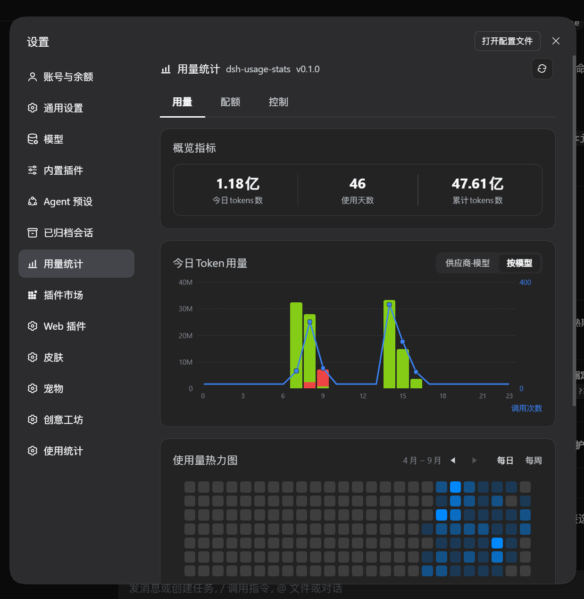
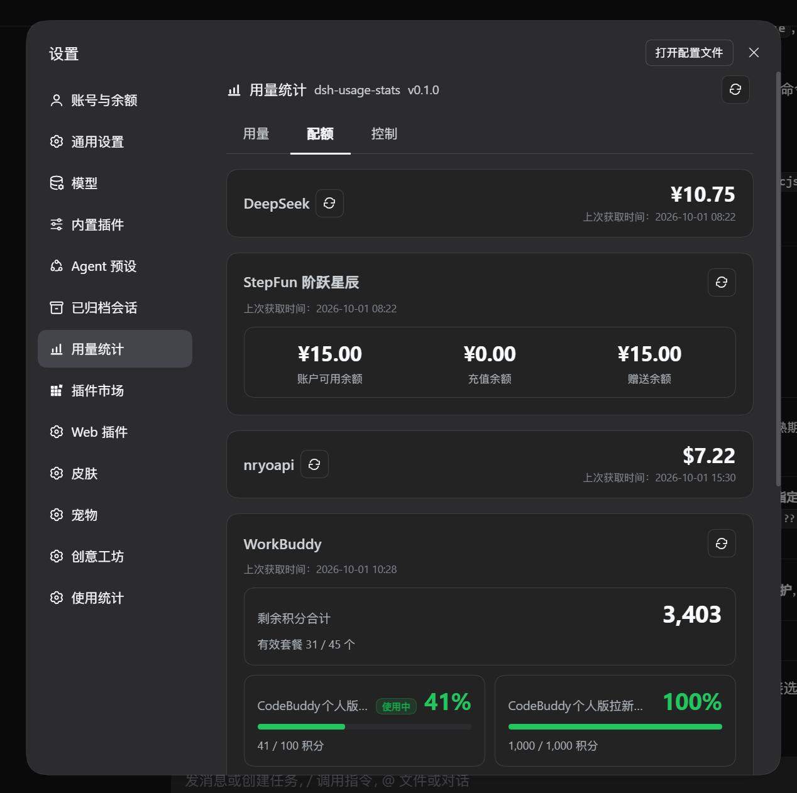
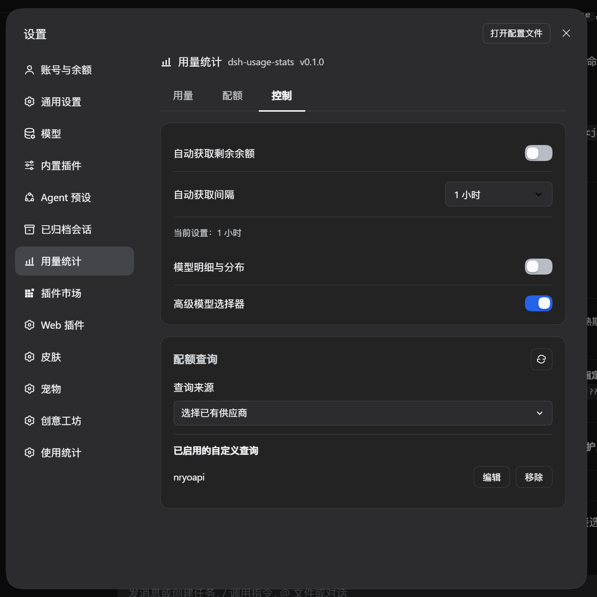

# dsh-usage-stats · 用量统计

[English](README.md) | [中文](README.zh-CN.md)

[DeepSeek Harness 桌面端](https://github.com/deepseek-ai/deepseek-harness) 的 Token 用量与配额插件。打开 **设置 → 用量统计**，即可查看用量历史、已连接账号的配额与查询控制。

通过外部 bundle 补丁加载，无需修改 DSH 源码。适用于 `desktop` profile 和 Electron 主窗口。

## 界面展示

### 用量

今日 Token、使用天数、累计 Token、小时用量与调用次数，以及每日／每周热力图。



### 配额

供应商余额、订阅窗口与可选的 WorkBuddy 积分。实际卡片取决于已有供应商、账号权限和查询结果。



### 控制

自动获取、查询间隔、模型明细、高级模型选择器与自定义查询。



## 功能

- 每日／每周热力图与翻页，今日 24 小时 Token 柱图及调用次数折线。
- 模型分布与明细；历史筛选支持 7／30／365 天和全部，概览卡片保持今日／完整历史口径。
- Token 紧凑显示，提示保留准确值，调用次数使用整数。日期跟随桌面系统时区。
- 内置 Claude、DeepSeek、StepFun、Codex、Copilot、OpenRouter、Moonshot、Kimi Coding、MiniMax、Z.AI／GLM Coding、阿里云 Token Plan 国内版、xAI、OpenCode Go 配额读取器；能否获取取决于凭据、权限与上游接口。
- 启用可选的 `dsh-workbuddy-connect` 后，分别展示与刷新 WorkBuddy／WorkBuddy AI 积分；其他功能不依赖该插件。
- 自定义 JSON 查询：选择已有供应商，编辑、测试、确认后启用；覆盖对应内置读取器，移除后恢复。
- 可选的模型／推理强度面板与滑条，关闭后立即恢复官方选择器。
- DSH 浅色／深色主题、自适应图表、键盘供应商选择器与固定标签页。

自动查询和高级模型选择器**默认关闭**，模型明细**默认开启**。间隔支持 10 分钟、1 小时（默认）、5 小时、每天。开启自动查询需要确认可能产生的成本；关闭设置页后宿主仍按间隔执行。配额页通常只读缓存，刷新按钮才触发新查询。

## 安装

需要 DSH 桌面端，以及用于构建的 Node.js。开发命令已在 Node.js 24 验证。SQLite 指纹要求宿主支持 `node:sqlite`，否则插件回退为重读会话。

```sh
git clone https://github.com/Jockjrop/dsh-usage-stats.git
cd dsh-usage-stats
npm ci
npm run build
npm test
```

将本地包加入 **desktop** profile。当前 DSH CLI 将此 profile 保留给 Electron 管理，不能使用 `dsh plugin --profile desktop` 操作。

Windows 手动安装步骤：

1. 完全退出 DSH 桌面端，将克隆目录保存在固定位置。
2. 备份 `<DSH_HOME>/profiles/desktop/package.json`。在已有依赖中加入 `dsh-usage-stats`，值为 `link:<克隆目录绝对路径>`；在已有的 `dsh.profile.bundles` 数组末尾加入 `dsh-usage-stats`。保留其他条目，链接路径使用正斜杠。
3. 在该 desktop profile 目录运行 `pnpm install`。
4. 启动 DSH 桌面端，进入 **设置 → 用量统计**。

以下仅展示需要合并的两个条目。替换链接占位符，不要覆盖整个 profile 文件：

```json
{
  "dependencies": {
    "dsh-usage-stats": "link:<克隆目录绝对路径>"
  },
  "dsh": {
    "profile": {
      "bundles": ["dsh-usage-stats"]
    }
  }
}
```

`DSH_HOME` 为 DSH 数据目录；未设置时，插件使用当前用户主目录下的 `.dsh`。克隆目录可以放在任意位置，不依赖特定机器的绝对路径。

更新时拉取仓库，运行 `npm ci`、`npm run build`、`npm test`，再重启桌面端。卸载时退出应用，仅移除此依赖和 bundle 条目，在 desktop profile 运行 `pnpm install`，然后重启。

## 配额查询

已配置但未查询的余额可能显示 **未查询**。权限不足、登录过期、接口不可用或响应无效时，卡片可能隐藏或显示无法获取。展示的是接口返回结果，不会把 Token 数估算为账号费用。

进入 **控制 → 配额查询**，选择供应商并编辑模板，先**测试**，再**确认**。修改模板后需重新测试；成功结果有效期为 15 分钟。

假设接口返回 `{ "data": { "balance": 12.34 } }`：

```json
{
  "url": "https://api.example.com/balance",
  "method": "GET",
  "auth": "provider",
  "headers": { "accept": "application/json" },
  "response": {
    "metrics": [
      { "label": "账户可用余额", "kind": "amount", "remaining": "data.balance", "currency": "CNY" }
    ]
  }
}
```

请将示例 URL 替换为真实接口。模板支持 GET／POST、JSON body、余额／窗口指标，以及 `data.items[0].balance` 等路径。窗口支持 `remainingPercent`、`usedPercent`，或 `total` 与 `remaining`／`used`；`response.rows` 指定数组。无需认证时使用 `auth: "none"`。未知网关预填的 `/balance` 仅是可修改示例。

可选的宿主凭据引用：

| 读取器 | 凭据名称 |
| --- | --- |
| OpenRouter 账号总余额 | `OPENROUTER_MANAGEMENT_API_KEY` |
| xAI 预付余额 | `XAI_MANAGEMENT_API_KEY`、`XAI_TEAM_ID` |
| 阿里云 Token Plan 国内版 | `ALIBABA_CLOUD_ACCESS_KEY_ID`、`ALIBABA_CLOUD_ACCESS_KEY_SECRET`；临时凭据可加 `ALIBABA_CLOUD_SECURITY_TOKEN` |

其他读取器使用对应的 DSH 供应商凭据或支持的已有 OAuth 登录。Claude、Codex、Copilot 不刷新或改写登录。OpenCode Go 只使用自身 DSH 凭据；Zen 无内置钱包读取器，但支持自定义查询。阿里云国际版 Token Plan 暂未接入。

## 隐私与本地数据

- 用量在宿主汇总；语料库保存统计数、模型标识和精简时间记录，不保存对话正文。
- 凭据仅在宿主解析，用于对应配额接口。API Key、OAuth Token 和完整上游响应不返回渲染进程。
- 认证自定义查询必须与供应商配置或官方配额地址同源。模板拒绝 URL 密钥参数、认证请求头及 body 中常见的凭据字段。请求不跟随重定向；自定义 HTTP 查询超时 8 秒，响应上限 1 MB。
- 本地接口检查连接地址、Host、Origin 与跨站请求。响应使用 `Cache-Control: no-store`；未知宿主异常只返回通用提示。
- WorkBuddy 使用当前宿主端口，只缓存配额展示字段。
- 无分析上报或遥测接口。测试查询、手动刷新，以及开启后的自动刷新会访问对应配额服务。

| `<DSH_HOME>/storages/` 下的文件 | 内容 |
| --- | --- |
| `usage-stats-corpus.json` | 按会话保存的用量贡献 |
| `usage-stats-controls.json` | 控制设置、自定义模板与配额快照 |

这些文件含私人用量或账号信息，路径在运行时解析。运行数据、环境文件、凭据、数据库、日志、备份和预览均排除在 Git 之外，npm 包采用明确的文件白名单。展示图使用用户提供的截图，数值反映截图时的配置。

回环接口以可信本机为前提；同一用户权限下的其他进程可以访问本地数据。

## 开发

只编辑 **`src/`**。`npm run build` 同步到 `lib/` 和根目录兼容副本；包入口加载 `lib/`。

```text
src/                  宿主、客户端、配额读取器与控制源码
lib/                  生成的包入口
test/                 隔离的行为、隐私与副本一致性测试
test/fixtures/        可移植的 DSH 主题变量契约
scripts/              构建与模拟热力图检查
screenshots/          用量、配额、控制展示图
cordis.patch.yml       仅桌面端加载的 bundle 注册
```

测试使用模拟数据与临时 DSH 目录，无需真实凭据、付费调用或已安装的 DSH 实例。主题测试使用随仓库提供的变量契约；可设置 `DSH_THEME_CLIENT` 指向主题客户端文件，验证其他已安装版本。

```sh
node scripts/render-heatmap-check.mjs
node scripts/check-heat-tip-placement.mjs
npm run preview:heatmap
npm pack --dry-run
```

预览生成已忽略的 `preview-heatmap.html`。一致性测试确保源码、包入口与兼容副本相同。

`platform: "web"` 是 DSH 桌面端的渲染通信格式；两端入口均限制 desktop profile，客户端还要求原生 `dshDesktop.deviceInfo` 桥接。普通 Web／浏览器 profile 不启动插件。

## 本地接口

以下路由使用 `/api/dsh-usage-stats/` 前缀，并受回环来源检查保护。

| 路由 | 方法 | 作用 |
| --- | --- | --- |
| `stats` | GET | 用量；`days`、`tz`、`model`、`fresh=1` |
| `provider-quotas` | GET | 配额缓存；`fresh=1` 刷新 |
| `workbuddy`、`workbuddy-ai` | GET | 可选适配器缓存；支持 `fresh=1` |
| `controls` | GET／POST | 读取／修改控制设置，写入要求 JSON |
| `quota-providers` | GET | 已有供应商与无凭据模板 |
| `quota-test` | POST | 测试模板并返回限时确认 ID |

`stats.billed` 为输入、输出、缓存读取和缓存写入 Token 之和。语料库每 30 秒刷新；接口最多等待 1500 ms，可返回 `stale: true`／`partial: true`。时区变化时按已存事件重新分桶；只剩逐小时聚合的旧历史在半小时时区边界上可能有近似。

## 许可

[Apache-2.0](LICENSE)
